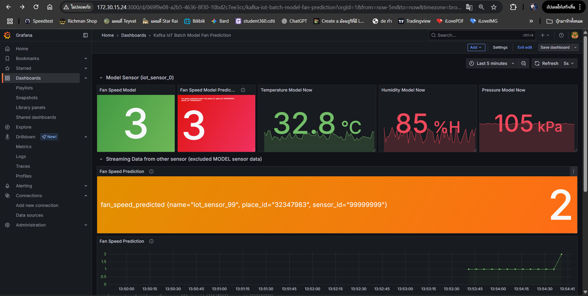

# Online Prediction

<!-- Online Prection ทำงานอย่างไร  -->

## ปิดการใช้งานของ Batch ML ดังนี้

1. Kafka-to-Json
2. Train-from-data
3. Predicted-then-infuxdb

## เริ่มใช้งาน Online ML ดังนี้

1. docker compose down batch ml
2. แก้ .env
3. docker compose up online ml

## ผลที่ได้จากการใช้ ML มีดังนี้

<!-- แนบรูป Grafana  พร้อมอธิบาย -->
## ภาพG1คือ ของIot sensor 0 dashboard

Fan Speed Model → ค่าความเร็วพัดลมปัจจุบันที่โมเดลคำนวณ
Fan Speed Model Prediction → ค่าความเร็วพัดลมที่โมเดลคาดการณ์
Temperature Model Now → อุณหภูมิที่วัดได้ตอนนี้
Humidity Model Now → ความชื้นสัมพัทธ์ตอนนี้
Pressure Model Now → ความดันอากาศตอนนี้
Fan Speed Prediction → ค่าพัดลมที่ทำนายสำหรับเซนเซอร์อีกตัว